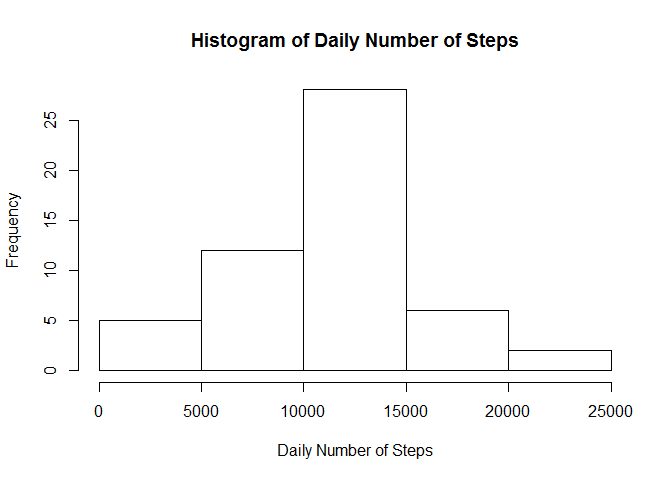
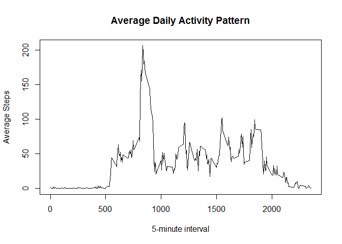
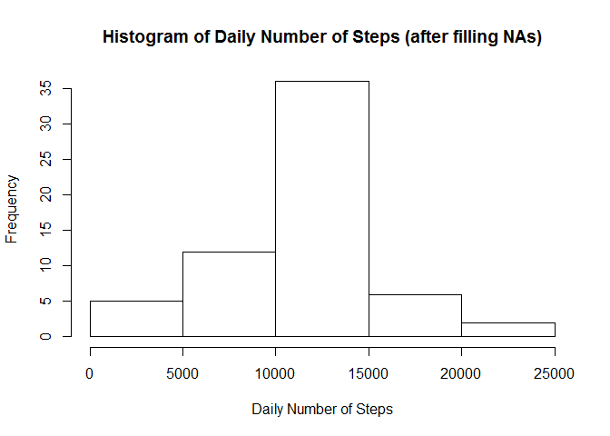

# Reproducible Research: Peer Assessment 1


## Loading and preprocessing the data
1. Unzip and Load the data

```r
library("dplyr")
```

```
## Warning: package 'dplyr' was built under R version 3.1.2
```

```
## 
## Attaching package: 'dplyr'
## 
## The following object is masked from 'package:stats':
## 
##     filter
## 
## The following objects are masked from 'package:base':
## 
##     intersect, setdiff, setequal, union
```

```r
library("lattice")
unzip("activity.zip")
raw_data <- read.csv("activity.csv")
```

2. Remove NA's and Compute daily aggregate

```r
data <- raw_data[!is.na(raw_data$steps), ]
daily_data <- summarise(
  group_by(data, date), 
  num_steps = sum(steps)
  )
```

## What is mean total number of steps taken per day?
1. Draw Histogram of daily number of Steps 

```r
with (daily_data, 
      hist(num_steps,
          xlab = "Daily Number of Steps",
          main = "Histogram of Daily Number of Steps")
      )
```

 

```r
# Compute mean and median
m1 = as.integer(mean(daily_data$num_steps))
m2 = as.integer(median(daily_data$num_steps))
```

2. The mean of the daily number of steps is 10766
3. The median of the daily number of seps is 10765

## What is the average daily activity pattern?
1. Draw the Time series plot of Average Daily Activity Pattern

```r
interval_data <- summarise(
  group_by(data, interval), 
  avg_steps = mean(steps)
  )
with(interval_data,
     plot(interval, 
          avg_steps, 
          type="l",
          xlab = "5-minute interval",
          ylab = "Average Steps",
          main = "Average Daily Activity Pattern")
     )
```

 

2. Compute the 5-min interval with maximum number of steps

```r
max_interval <- arrange(interval_data, desc(avg_steps))[[1, "interval"]]
```
  
The 5-min interval with maximum average number of steps is 835.

## Imputing missing values

```r
num_na <- nrow(raw_data[is.na(raw_data$steps), ])
```
1. The number of rows with NA is 2304
2. We will use the 5-min interval average to fill the missing values.

```r
# Fill with 5-min interval average
data_adj <- inner_join(raw_data, interval_data, by = "interval")
data_adj[is.na(data_adj$steps), "steps"] <- data_adj[is.na(data_adj$steps), "avg_steps"]

# Compute daily aggregate
daily_data_adj <- summarise(
  group_by(data_adj, date), 
  num_steps = sum(steps)
  )
```

3. Draw histogram with adjusted data

```r
with (daily_data_adj, 
      hist(num_steps,
          xlab = "Daily Number of Steps",
          main = "Histogram of Daily Number of Steps (after filling NAs)")
      )
```

 

```r
m3 = as.integer(mean(daily_data_adj$num_steps))
m4 = as.integer(median(daily_data_adj$num_steps))
```
4. The mean of the daily number of steps (after filling NAs) is 10766. The difference in the mean is 0.
5. The median of the daily number of steps (after filling NAs) is 10766. The difference in median is 1

## Are there differences in activity patterns between weekdays and weekends?
1. Creating a new factor variable 

```r
data_adj <- mutate(data_adj, 
                   day = ifelse (
                     weekdays(
                       as.Date(date, "%Y-%m-%d")) %in% 
                       c("Saturday", "Sunday"),
                     "weekend",
                     "weekday"
                     )
                   )

interval_data_adj <- summarise(group_by(data_adj,interval, day), 
                               avg_steps = mean(steps)
                               )

xyplot(avg_steps ~ interval | day,
       data = interval_data_adj,
       layout = c(1, 2),
       type = "l",
       xlab = "Interval",
       ylab = "Number of Steps")
```

 
